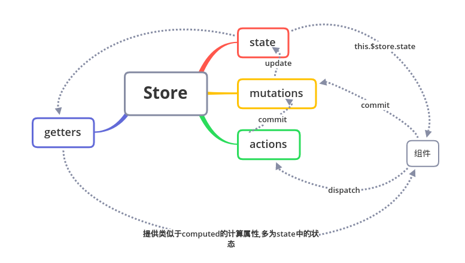

# Vuex的基本使用

[TOC]

## 项目结构

```bash
├── index.html
├── main.js
├── api
│   └── ... # 抽取出API请求
├── components
│   ├── App.vue
│   └── ...
└── store
    ├── index.js          # 我们组装模块并导出 store 的地方
    ├── actions.js        # 根级别的 action
    ├── mutations.js      # 根级别的 mutation
    ├── getters.js      # 根级别的 mutation
    └── modules
        ├── cart.js       # 购物车模块
        └── products.js   # 产品模块
```

## 在main.js中注入store对象

`main.js`中的关键代码

```javascript
import store from './store'

new Vue({
  router,
  store,
  render: h => h(App)
}).$mount('#app')

```

`index.js`中的关键代码

```javascript
import Vue from 'vue'
import Vuex from 'vuex'
import mutations from './mutations'
import actions from './actions'
import getters from './getters'
import cart from './modules/cart'
import products from './modules/products'

Vue.use(Vuex)

export default new Vuex.Store({
  state,
  mutations,
  actions,
  getters,
  modules: {
    cart,
    products
  },
})

```

这样全部的组件就可以通过`this.$store`来访问store对象了

## Vuex的基本通信方式



也就是说,组件中所有需要共享的或者说需要通信的内容,全部都可以存在store中,准确的说是store.state中.这样每一个组件都可以访问到相同的内容,非常方便.

## 注意事项

- state对于组件而言只是可读的,不可以直接修改state中的内容
- 组件要想就修改state中的状态,要么dispatch提交actions,要么commit提交mutations
- mutations中所有的操作的都是同步的,所以请把所有的异步操作放在actions中
- getters和actions对于state也仅仅只是可读的
